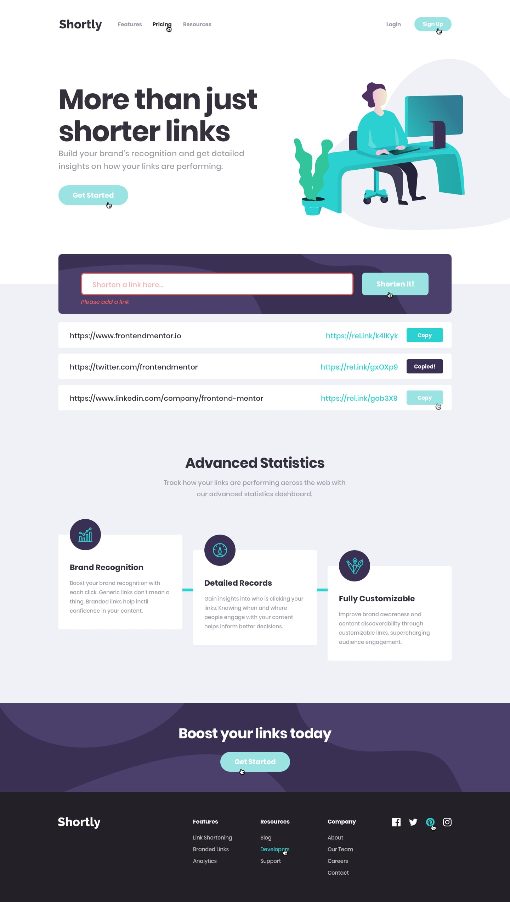
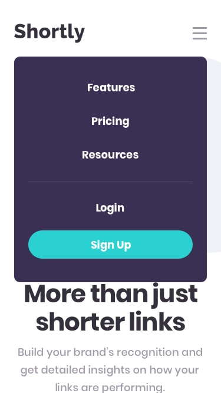

<h2>URL shortening API</h2>

This is my solution to <strong>URL shortening API</strong> challenge by Frontendmentor.io.  which turn long links into short ones and you can also copy the link in clipboard.

<h3>Live Link</h3>
<a href="https://sonakshirawat.github.io/URL-shortening-api-master/">Click here</a>

<h3>Features</h3>
<ul>
<li> Shorten any valid URL</li>
<li> Copy the shortened link to their clipboard in a single click</li>
<li> Receive an error message when the `form` is submitted if the `input` field is empty</li>
<li>See the hover states for all the interactive elements on the page</li>
<li>View the optimal layout for the site depending on their device's screen size</li>
<li>API used: shrtcode API.</li>
</ul>

 
<h3>Build Using</h3>
<ul>
  <li>HTML5 Markup language</li>
  <li>CSS3 Custom Properties</li>
     <li>Vanilla javascript</li>
</ul>

<h3>Screenshots</h3>
 
 

 
 

